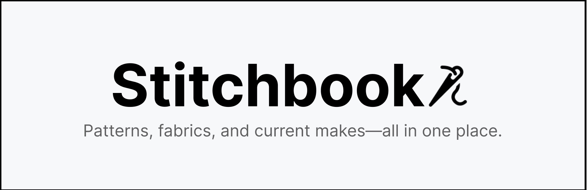
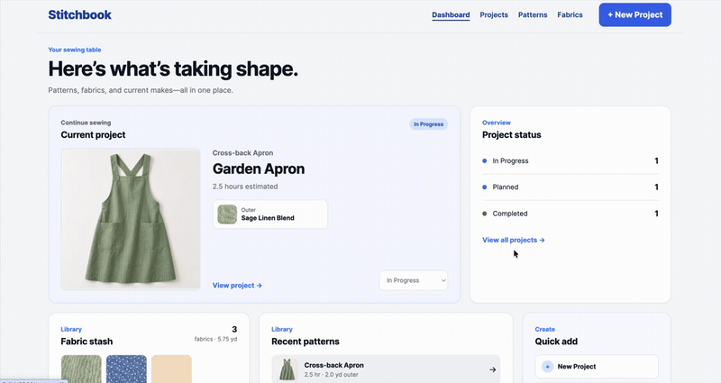
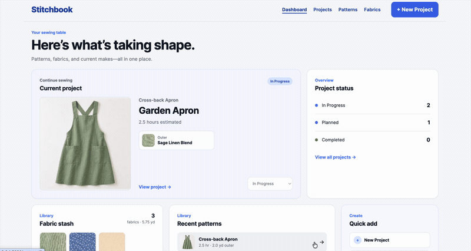
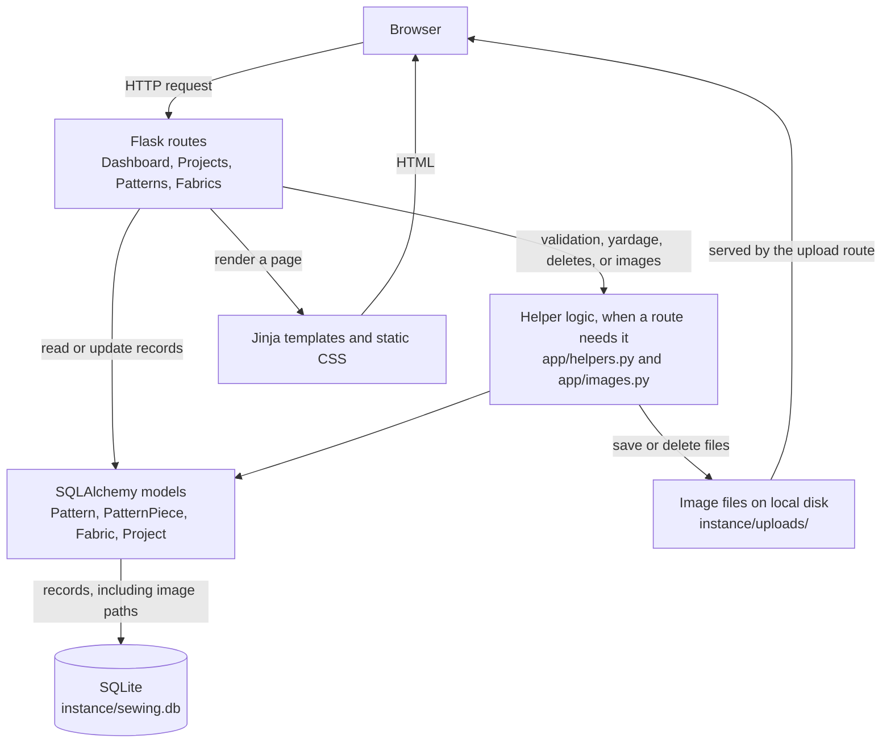

# Stitchbook



Stitchbook is a small local web app for keeping sewing projects, patterns, and fabric in one place. It is for someone who sews and wants one spot for what they are making, which pattern it uses, and whether the fabric on hand is enough.

Sewing details are easy to scatter across notes, photos, and scraps of paper. Stitchbook keeps the project, the pattern, and the stash together, and compares required yardage with the fabric you already have. Fabric amounts change only when you edit them.

## Table of contents

- [Overview](#overview)
- [Features](#features)
- [Tech stack](#tech-stack)
- [Quickstart](#quickstart)
- [Usage](#usage)
- [Architecture](#architecture)
- [FAQ](#faq)

## Overview

Stitchbook is a Flask application with four areas: a dashboard, projects, patterns, and fabrics. A project uses one pattern, one required outer fabric, and an optional lining fabric. Estimated time and yardage come from the pattern.

The interface is server-rendered HTML and CSS. Data is stored in a SQLite file on the computer running the app. There are no user accounts.

Optional photos can be attached to a pattern, pattern piece, fabric, or project. Those files stay on local disk.

## Features

- **Dashboard.** See your most recently created in-progress project, counts for Planned, In Progress, and Completed, recent patterns, and a short summary of the fabric stash.
- **Patterns.** Save a pattern's name, estimated time, outer yardage, optional lining yardage, notions, and notes. Record the pieces to cut, including quantity, measurements, and fabric type.
- **Fabrics.** Keep a stash list with yards on hand, a description, and notes.
- **Projects.** Create a named project from one pattern, one outer fabric, and an optional lining fabric. Add notes and a status.
- **Status.** Move a project among Planned, In Progress, and Completed. The project list opens on In Progress and can be filtered by status.
- **Yardage check.** Compare the yards a pattern needs with the yards available on the fabric you selected. The Project Preview panel shows that comparison before you save.
- **Photos.** Add an optional photo when you create or edit a pattern, piece, fabric, or project.

## Tech stack

- Python, Flask, and Flask-SQLAlchemy
- Jinja templates and one handwritten CSS file
- SQLite
- pytest

Dependencies are listed in `requirements.txt`.

## Quickstart

Python 3.10 or newer is recommended. This repository does not pin a Python version. The commands below are for macOS or Linux. On Windows, activate the virtual environment with `.venv\Scripts\activate` instead of `source`.

Create and activate a virtual environment:

```bash
python3 -m venv .venv
source .venv/bin/activate
```

Install the dependencies:

```bash
pip install -r requirements.txt
```

Initialize the SQLite database:

```bash
flask --app run init-db
```

The database is stored locally at `instance/sewing.db`. Uploaded images are stored under `instance/uploads/`. Both paths are ignored by git. The application also creates its tables and upload folders when it starts, so `init-db` is safe to run more than once.

### Optional demo data

To add sample patterns, pieces, fabrics, and projects to an empty database:

```bash
flask --app run seed
```

The seed command refuses to run when the database already contains patterns, fabrics, or projects.

To return to a completely empty database and remove uploaded images:

```bash
flask --app run reset-db --yes
```

That command permanently deletes all local application data, including photos. Alternatively, stop the app and delete `instance/sewing.db`. Deleting only that file leaves any uploaded images on disk. See the [FAQ](#faq).

### Run the application

```bash
flask --app run run --debug
```

Open <http://127.0.0.1:5000> in a browser. Port 5000 is Flask's default for this command. The repository does not set a different port.

### Run the tests

```bash
pytest
```

Tests use a temporary SQLite database and do not change your personal data.

### Optional settings

No environment file is required for a first run.

- `SECRET_KEY` sets Flask's secret key. It defaults to `dev`.
- `DATABASE_URL`, when set, must be a full SQLAlchemy database URI. Otherwise Stitchbook uses `instance/sewing.db`.

## Usage

A project needs at least one pattern and one fabric. The dashboard says so when either is missing. The steps below use the optional demo data from Quickstart, which includes an in-progress tote, a planned pouch, and a completed apron.

### Add a pattern and a fabric

1. Open **Patterns** and choose **Add pattern**. Enter a name, estimated hours, and outer yards. Leave lining yards blank when the pattern has no lining.
2. On the pattern page, add each piece to cut: name, quantity, and any measurements or fabric type.
3. Open **Fabrics** and choose **Add fabric**. Enter a name and the yards you have.

Photos are optional on each of these forms.

### Create a project

1. Choose **+ New Project**.
2. Enter a project name.
3. Choose a pattern, an outer fabric, and a lining fabric if you want one.
4. Watch the **Project Preview** panel. It updates with the estimated time, required yardage, available fabric, and whether there is enough fabric. Nothing is saved yet.
5. Choose **Save project** when the plan looks right. The project page shows the same comparison, plus the pieces to cut.



### Change a project's status

1. Open **Projects**. The list starts on **In Progress**.
2. On a project card, choose a new status from the dropdown. The change saves immediately.
3. Stitchbook opens the list for that status, and the project appears there.

The same dropdown is on the dashboard and on the project page. From any of those places, saving a status opens the matching project list.



### Use the dashboard

After a few records exist, the dashboard is the home page. It highlights the most recently created in-progress project, links to each status, and lists recent patterns and fabrics. **Quick add** jumps to a new project, pattern, or fabric.

## Architecture

A browser request reaches a Flask route. That route reads or updates SQLAlchemy models directly when it only needs to load or save records. It calls shared helper code when the request needs validation, a yardage comparison, a delete check, or image handling. The route then renders a Jinja template, and the CSS in `app/static/css/style.css` styles the HTML sent back to the browser.

`app/images.py` stores uploaded files on local disk under `instance/uploads/`, grouped into `fabrics`, `patterns`, `projects`, and `pieces`. The database does not store the file itself. The related pattern, piece, fabric, or project stores the relative path in its `image_url` column. A small upload route serves those files back to the browser.



Feature routes are split into blueprints so the dashboard, patterns, fabrics, and projects are easy to find. The models live together in `app/models.py` so the relationships stay visible. CLI commands registered with the app initialize, seed, and reset local data.

### Data model

- A **Pattern** has many **PatternPiece** rows. Deleting a pattern deletes its pieces.
- A **Project** refers to one pattern, one outer fabric, and an optional lining fabric. The outer and lining references may point at the same fabric.
- Estimated hours and required yardage live on the pattern. A project does not keep its own copy.
- Allowed project statuses are `Planned`, `In Progress`, and `Completed`, defined in `app/constants.py`.

### Project structure

```text
sewing-project-tracker/
├── app/
│   ├── __init__.py          # application factory, upload route, CLI registration
│   ├── constants.py         # allowed project statuses
│   ├── helpers.py           # validation, delete checks, yardage comparison
│   ├── images.py            # local image save, replace, delete, and display paths
│   ├── models.py            # SQLAlchemy models and relationships
│   ├── routes/
│   │   ├── dashboard.py
│   │   ├── patterns.py
│   │   ├── fabrics.py
│   │   └── projects.py
│   ├── templates/           # Jinja pages grouped by feature
│   └── static/css/style.css
├── instance/                # local SQLite database and uploads (not committed)
├── tests/                   # model, helper, route, and image tests
├── config.py                # Flask, database, and upload settings
├── run.py                   # application entry point
├── seed.py                  # optional seed and reset CLI commands
├── requirements.txt
└── README.md
```

## FAQ

### Why can't I delete a pattern or fabric?

Stitchbook keeps a pattern that any project still uses, and it keeps a fabric that any project uses as outer fabric or lining. The delete page names those projects. Reassign or delete the projects first. Deleting a project leaves its pattern and fabrics in place.

### What else does delete remove?

Deleting an unused pattern also deletes that pattern's pieces. A single piece can be deleted from its pattern without deleting the pattern. Deleting a record also removes its local photo when no other record still points at that file.

### What does a blank lining field mean?

On a pattern, a blank lining amount means the pattern does not use lining. Entering `0` means the pattern does use lining and needs zero yards. A project can be saved without a lining fabric either way. When the pattern calls for lining and none is selected, the project page says that lining is still needed.

### Can I save a project when I don't have enough fabric?

Yes. The yardage comparison is informational. Saving does not reduce the yards stored on a fabric. Change the fabric's yards yourself when you use some.

### How do photos work?

Photos are optional JPG, PNG, or WebP files up to 5 MB. The form uses a normal file field. Choosing a new file replaces the current photo. Leaving the field empty keeps it. There is no separate control to clear a photo.

If a project has no photo of its own, Stitchbook shows the pattern photo, and then the outer-fabric photo.

### Why did the seed command refuse to run?

`flask --app run seed` runs only when the database has no patterns, fabrics, or projects. That avoids duplicate demo rows. Reset the database first if you want to load the sample set again.

### I deleted the database file. Why are old photos still there?

Removing `instance/sewing.db` drops the records the next time the app creates a new file. It does not empty `instance/uploads/`. `flask --app run reset-db --yes` clears both the tables and the uploaded files.
